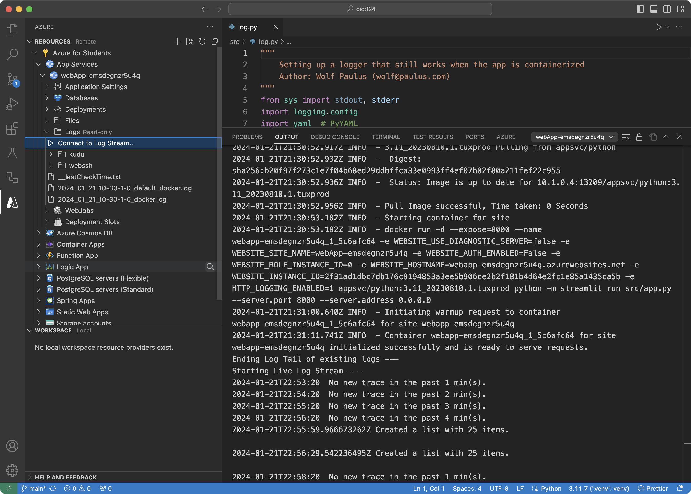

# ERAU CS 399 2024 
## CI/CD

### Logging

Messages that the application posts to stdout or stderr appear with a short delay in the application log. In the ```arm/app_service.json``` it is currently configured with a Quota (MB) of 40, look for the **logsDirectorySizeLimit** parameter.

With the Azure extension installed, the application's log can be inspected inside VSCode.

